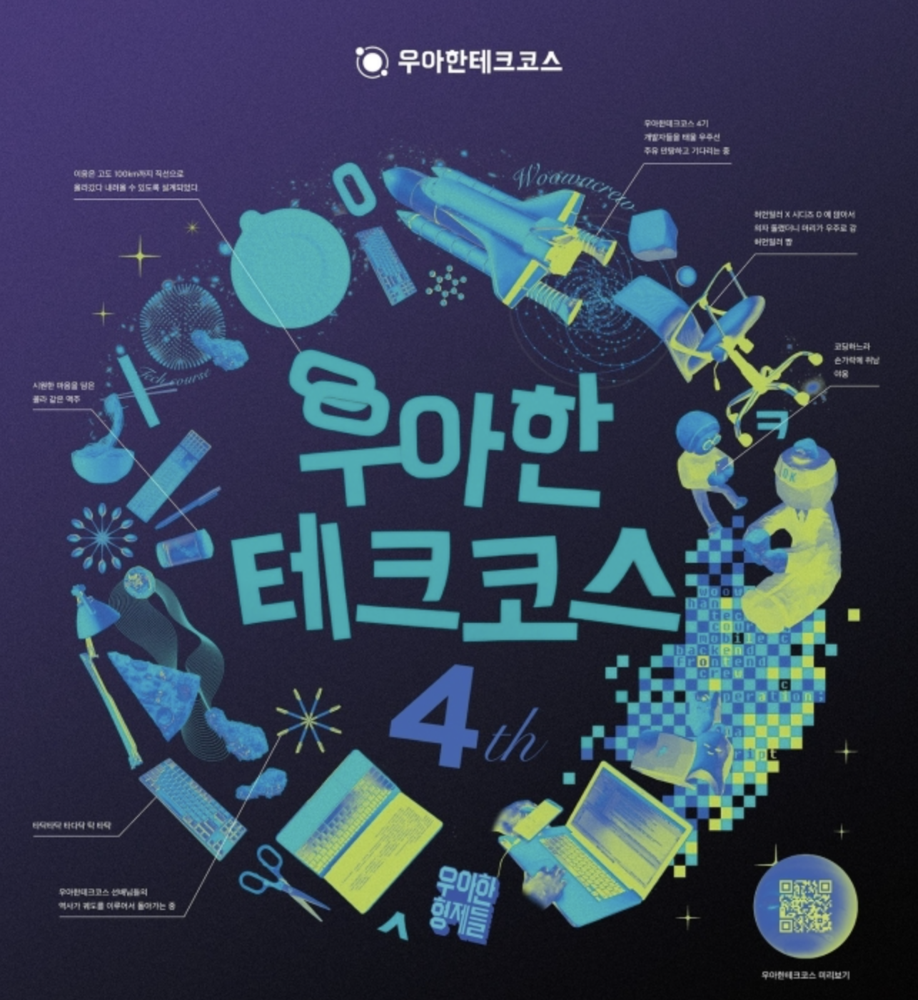

# 🎞 woowacourse-record 🎶

    

## 🥚 프리코스
### 기간
- 2021.11.24 - 2021.12.18

### 진행 미션
| Mission             | Repository | Pull Request |
| ---------------- | ---------- | ---------- |
| 숫자 야구 게임   | [java-baseball-precourse](https://github.com/hanull/java-baseball-precourse/tree/hanull) | [Pull Request](https://github.com/woowacourse/java-baseball-precourse/pull/492)|
| 자동차 경주 게임 | [java-racingcar-precourse](https://github.com/hanull/java-racingcar-precourse/tree/hanull) | [Pull Request](https://github.com/woowacourse/java-racingcar-precourse/pull/446) |
| 자판기           | [java-vendingmachine-precourse](https://github.com/hanull/java-vendingmachine-precourse/tree/hanull) | [Pull Request](https://github.com/woowacourse/java-vendingmachine-precourse/pull/146) |
| 최종 테스트 | [java-pairmatching-precourse](https://github.com/hanull/java-pairmatching-precourse/tree/hanull) | [Pull Request](https://github.com/woowacourse/java-pairmatching-precourse/pull/103) |

### 블로그 포스팅
- [[Java] 자바 버전 변경하기](https://github.com/hanull/TIL/blob/master/ETC/%EC%9E%90%EB%B0%94%20%EB%B2%84%EC%A0%84%20%EB%B3%80%EA%B2%BD%ED%95%98%EA%B8%B0.md)
- [[Java] Character 클래스 정리](https://github.com/hanull/TIL/blob/master/Java/Character%20%ED%81%B4%EB%9E%98%EC%8A%A4%20%EC%A0%95%EC%A0%81%20%EB%A9%94%EC%84%9C%EB%93%9C.md)

## 🥚 레벨 1 : 프로그래밍 기본 (TDD, OOP, Refactoring, Clean Code)
### 기간
- 2022.02.09 - 2022.04.08

### 학습 목표
- 자바 프로그래밍 언어에 대한 기본 문법을 익혀 프로그래밍하는 경험을 한다.
- 읽기 좋은 코드를 구현하는 것이 왜 중요한지, 코드를 개선해 읽기 좋은 코드로 변경해 보는 경험을 한다.
- 자신이 구현한 코드에 대해 단위 테스트와 리팩토링하는 경험을 한다.
- 웹 프로트엔드에서 웹 백엔드까지 프로그래밍해 웹 애플리케이션을 개발하는 경험을 한다.

### 진행 미션
| Mission             | Repository | Pull Request | Pair | Reviewer |
| ---------------- | ---------- | ---------- | ------ | -------- |
| 자동차 경주 게임  | [java-racingcar/step1](https://github.com/hanull/java-racingcar/tree/step1) | [Pull Request](https://github.com/woowacourse/java-racingcar/pull/337) | [이프](https://github.com/sinb57) | [카일](https://github.com/KIMSIYOUNG) 
|  | [java-racingcar/step2](https://github.com/hanull/java-racingcar/tree/step2) | [Pull Request](https://github.com/woowacourse/java-racingcar/pull/429) |  | [카일](https://github.com/KIMSIYOUNG) 
| 로또 | [java-lotto/step1](https://github.com/hanull/java-lotto/tree/step1) | [Pull Request](https://github.com/woowacourse/java-lotto/pull/404) | [주디](https://github.com/jurlring) | [범블비](https://github.com/ddaaac)
|  | [java-lotto/step2](https://github.com/hanull/java-lotto/tree/step2) | [Pull Request]() |  | [범블비](https://github.com/ddaaac)

### 블로그 포스팅
- [[Java] 불필요한 객체 생성을 피하라](https://hanul-dev.netlify.app/java/%EC%95%84%EC%9D%B4%ED%85%9C6.-%EB%B6%88%ED%95%84%EC%9A%94%ED%95%9C-%EA%B0%9D%EC%B2%B4-%EC%83%9D%EC%84%B1%EC%9D%84-%ED%94%BC%ED%95%98%EB%9D%BC/)
- [[Java] 불변 객체를 만드는 방법](https://hanul-dev.netlify.app/java/%EB%B6%88%EB%B3%80%EA%B0%9D%EC%B2%B4%EB%A5%BC-%EB%A7%8C%EB%93%9C%EB%8A%94-%EB%B0%A9%EB%B2%95/)

### 스터디
- [[객체 지향과 디자인 패턴] 객체 지향](https://github.com/hanull/book-notes/tree/main/%EA%B0%9D%EC%B2%B4%EC%A7%80%ED%96%A5%EA%B3%BC%20%EB%94%94%EC%9E%90%EC%9D%B8%ED%8C%A8%ED%84%B4/chapter2)
